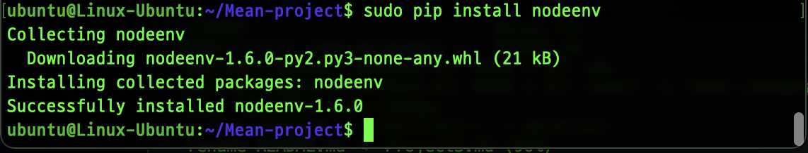
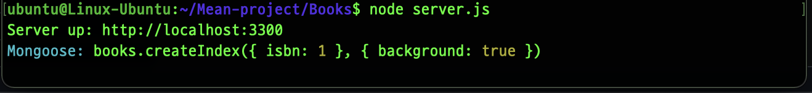
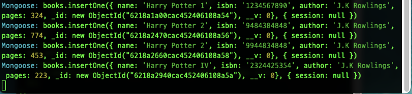
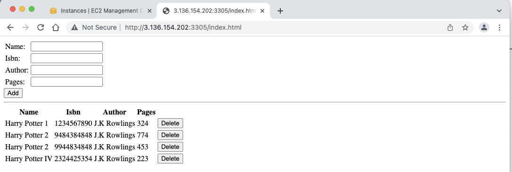

# MEAN IMPLEMENTATION 
---
MEAN Implementation is used for deploying a typical application, it is an acronym which stands for 
* M - MongoDB which is a database which stores and allows to retrieve data. 
* E - stands for Express; It is a back-end application framework which helps to handle database for read and write purposes.   
* A - Angular which is a front-end web framework
* N - Node which is the back-end web framework.

### INSTALLATION OF NODE.JS 
---
The first step is to install Node.js . But it is imperative that the server is kept update using these code

`sudo apt update`
`sudo apt upgrade`

Then, the certificates are then installed.

* `sudo apt -y install curl dirmngr apt-transport-https lsb-release ca-certificates `

*   `curl -sL https://deb.nodesource.com/setup_12.x | sudo -E bash`.

1. To install Node.js, I had to first, create a directory called Mean-project then afterwards create an virtual environment, however, the ubuntu EC2 instance does not have the pip package, hence, I had to install it using this command `sudo apt install python3-pip`  and afterwards used this command to install node.js environment  using `sudo pip nodeenv`.

### INSTALLATION OF EXPRESS.JS
---

1. The next step is to install MongoDB which is a database that stores data in a flexible, usually in a JSON-format documents. It is important to mention; that fields in the database vary from documents to document as well as data structure which changed over time.
The following commands were ran.

    `sudo apt-key adv --keyserver hkp://keyserver.ubuntu.com:80 --recv 0C49F3730359A14518585931BC711F9BA15703C6`

    `echo "deb [ arch=amd64 ] https://repo.mongodb.org/apt/ubuntu trusty/mongodb-org/3.4 multiverse" | sudo tee /etc/apt/sources.list.d/mongodb-org-3.4.list`

1a. The next step is to use these commands to install MongDB. 
    `sudo apt install -y mongodb`
    `sudo service mongodb start`
    `sudo systemctl status mongodb`
    `sudo apt install -y npm`

For express to effective read data from the body of the html documents, we have to install body parser modules. To install body-parser.

`sudo npm install body-parser`

2. I then created a directory and cd into Books.

    `mkdir Books && cd Books`, after which I go initialized the NPM project.

3. The next step is to created a file called server.js
`vi server.js` and insert code which initializes the server to allow it listen on a certain port.

4. Express allows information to be passed to and from the MongDB database. Hence, why its modules will be installed using the following commands.

    `sudo npm install express mongoose`.

5. After, the installation of express with mongoose. There is need to make a directory , I did this using the following command.

    `mkdir apps && cd apps`

The code bellow was used create a file which will contain different routes to the app which will be created. 
    `vi routes.js`
This file contains different routes which will be used to navigate various requests sent by the client(or user). 

6. The next step is to establish a  connection between the server and the database.
- The first step is a folder in the app folder and called it models. 

    `mkdir models && cd models`

### INSTALLATION OF ANGULAR
---
Angular JS is a front-end web framework that creates dynamic views for websites.
1. The first step is to change directory to Books. Then , create a folder which will be called public and insert the codes inside. 
2. After, step 1; I created files such as script.js file and the index.html but files allow for the dynamic creation of the  website application.
3. The next step is to cd to the application and start the server.js file. 

4. The last step is to use the DNS name to access the website. So inputs can be made to see if the application is running.

The following input were added to the application to see the result both as a JSON format and on the web page.

**For JSON FORMAT**

**For WEBPAGE FORMAT**

###Contributors
1. Temitope Temiola
